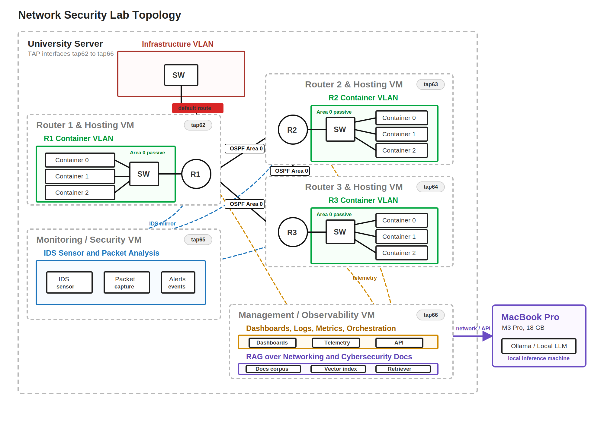

# Network Security Lab

Network Security Lab is a public portfolio project that starts with a complete OSPF routing lab and extends it into a network security observability platform.

The goal is to demonstrate practical networking, Linux infrastructure, monitoring, intrusion detection, incident documentation, and local AI-assisted troubleshooting in one coherent lab.

## Project Summary

This lab is built around a three-router OSPF topology using FRRouting. Once the routing foundation is stable, the project adds metrics, logs, dashboards, IDS alerts, controlled attack simulations, and a supporting local AI assistant.

The AI layer is not the core of the project. The foundation is the network: OSPF, VLANs, TAP interfaces, failure testing, observability, and security evidence.

## What This Project Demonstrates

- Dynamic routing with OSPFv2 and OSPFv3.
- FRRouting configuration and validation.
- VLAN and TAP-based virtual networking.
- IPv4 and IPv6 routing.
- Default route advertisement and hosting VLANs.
- Network failure testing and convergence measurement.
- Monitoring with Prometheus and Grafana.
- Centralized logging with Loki.
- Intrusion detection with Suricata.
- Controlled security simulations inside isolated lab VMs.
- Local AI-assisted troubleshooting with Ollama.
- Documentation, screenshots, evidence, and portfolio packaging.

## Topology



The initial topology uses three routers in an OSPF triangle:

| Node | Role | TAP |
| --- | --- | --- |
| `R1` | Router / default route origin | `tap62` |
| `R2` | Router | `tap63` |
| `R3` | Router | `tap64` |
| Monitoring VM | IDS sensor and security monitoring | `tap65` |
| Management VM | Observability and management services | `tap66` |
| MacBook Pro M3 Pro | Local AI inference with Ollama | Host |

Reserved TAP interfaces:

| TAP | Purpose |
| --- | --- |
| `tap67` | Future client, DMZ, or integration |
| `tap68` | Future expansion |
| `tap69` | Backup, debug, or future integration |

## Planned Stack

| Layer | Tools |
| --- | --- |
| Routing | FRRouting, OSPFv2, OSPFv3 |
| Virtual networking | TAP interfaces, VLANs, type 2 hypervisor VMs |
| Metrics | Prometheus, exporters |
| Dashboards | Grafana |
| Logs | Loki |
| IDS | Suricata first, Zeek as a possible future addition |
| AI inference | Ollama on Apple Silicon |
| AI backend | FastAPI |
| Retrieval | Local RAG over docs, configs, and selected references |

## Roadmap

The project is tracked in [docs/roadmap.md](docs/roadmap.md).

Current milestone structure:

| Milestone | Goal |
| --- | --- |
| M0 - Planning and Scope | Validate project scope, repo, tracker, TAP plan, and resources |
| M1 - OSPF Foundation | Build the complete FRRouting OSPF lab |
| M2 - Failure Testing | Measure convergence, packet loss, and route recovery |
| M3 - Observability | Add Prometheus, Grafana, Loki, logs, metrics, and alerts |
| M4 - Security / IDS | Deploy Suricata and document controlled incidents |
| M5 - AI Support Layer | Add local AI explanations for logs, alerts, and failures |
| M6 - RAG Knowledge Layer | Ground assistant answers in project docs and configs |
| M7 - Demo Interface | Optional topology, alerts, chat, and incident timeline UI |
| M8 - Portfolio Packaging | Final README, screenshots, evidence, video, and summary |

## Minimum Success Criteria

The project is considered successful if it delivers:

- Stable OSPFv2 and OSPFv3 routing between `R1`, `R2`, and `R3`.
- IPv4 and IPv6 connectivity across the lab.
- Documented routing tables, neighbors, configs, and packet evidence.
- Failure testing with measured convergence behavior.
- Grafana dashboards for network and system visibility.
- Centralized logs for routers and critical services.
- Suricata alerts from controlled lab-only simulations.
- Incident reports with evidence and conclusions.
- A public GitHub repository that explains the project clearly.

## Safety Boundary

All security testing is limited to the isolated lab environment.

Controlled scans, suspicious traffic, and brute-force simulations are only performed between lab VMs running in the local/type 2 hypervisor setup. No tests are intended to target external systems.

## Repository Structure

```text
.
├── README.md
├── docs
│   ├── ai-stack.md
│   ├── architecture.md
│   ├── images
│   │   └── topology.svg
│   ├── ospf-lab.txt
│   ├── project-calendar.md
│   ├── roadmap.md
│   ├── server-resources.md
│   └── tap-plan.md
└── LICENSE
```

## Documentation

- [Project roadmap](docs/roadmap.md)
- [Project calendar](docs/project-calendar.md)
- [Architecture](docs/architecture.md)
- [TAP plan](docs/tap-plan.md)
- [Server resources](docs/server-resources.md)
- [AI stack](docs/ai-stack.md)
- [OSPF lab reference](docs/ospf-lab.txt)

## Portfolio Story

I built a virtual OSPF routing lab and extended it into a network security observability platform with monitoring, IDS alerts, incident evidence, and local AI-assisted troubleshooting.

Suggested resume summary:

- Built a virtual OSPFv2/OSPFv3 network security lab with FRRouting, VLAN/TAP topology, Prometheus, Grafana, Loki, Suricata, and local Ollama-based troubleshooting support.
