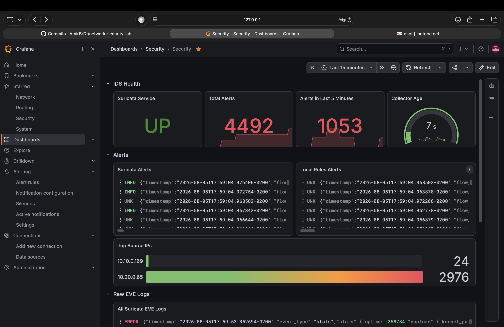
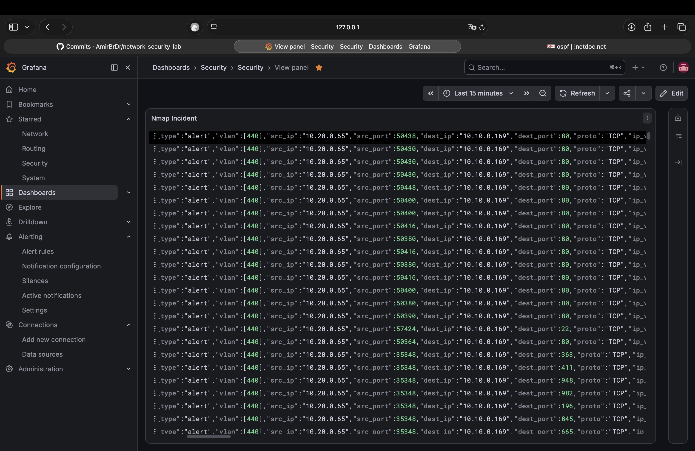
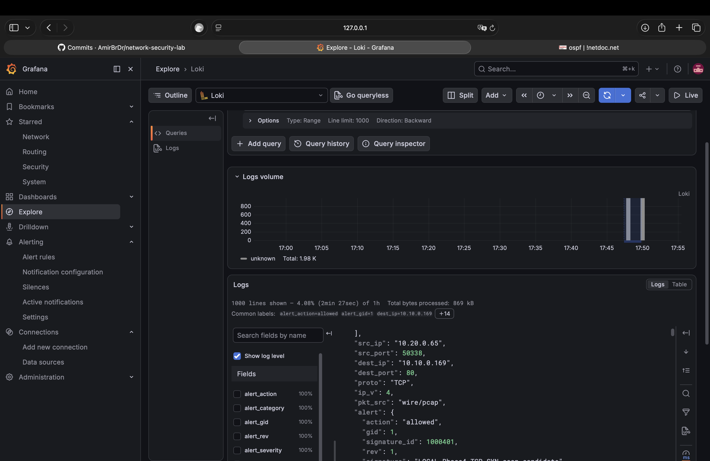
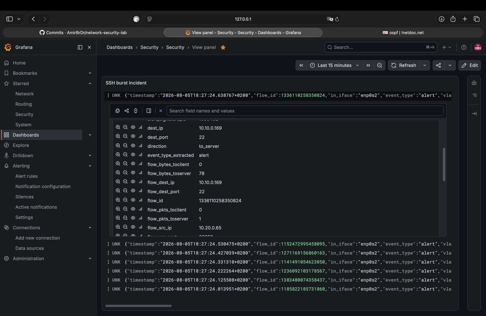
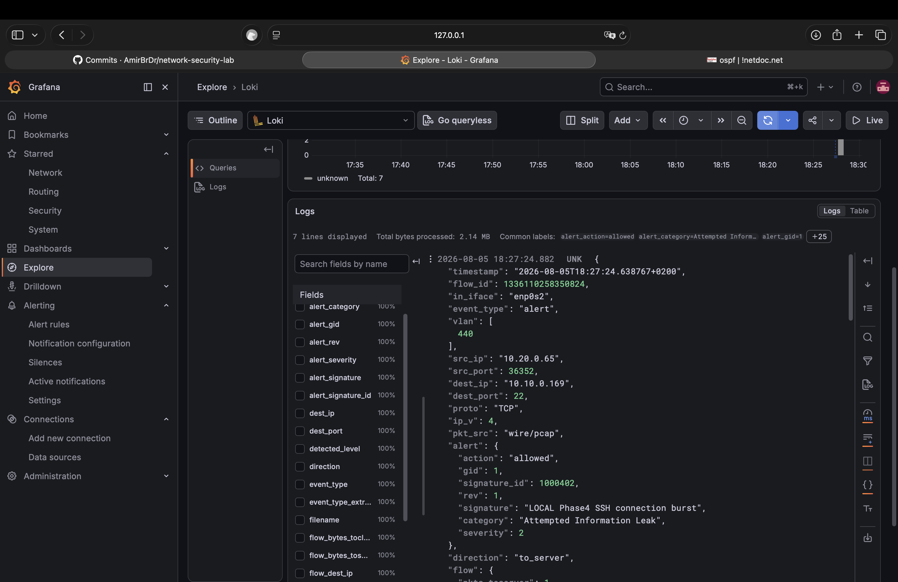
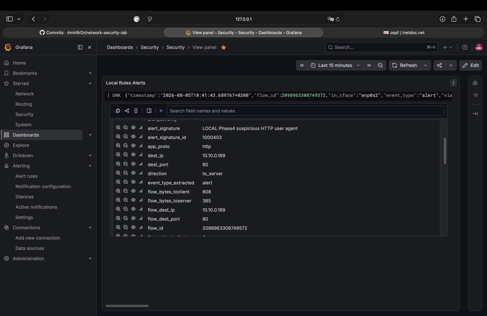
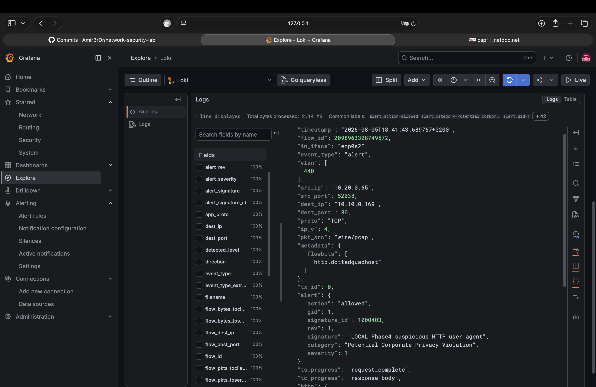
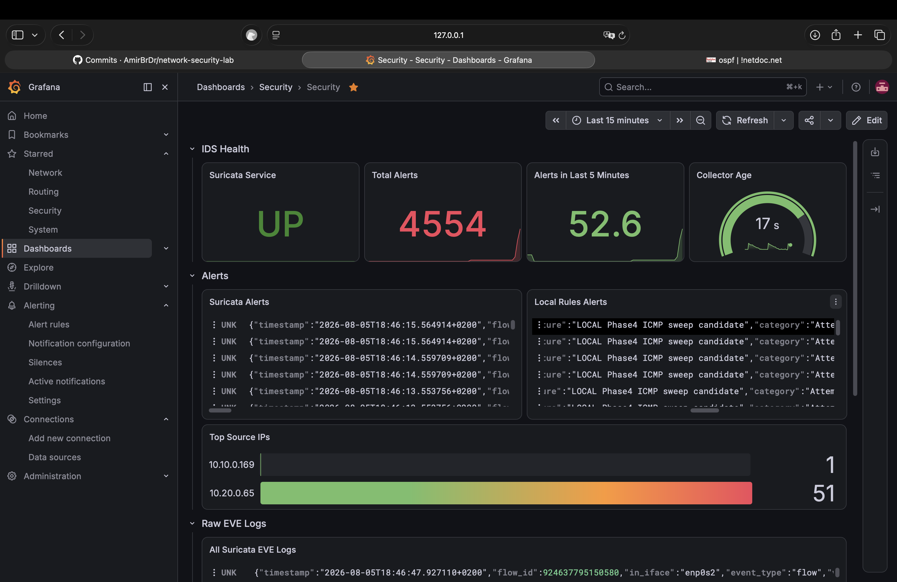
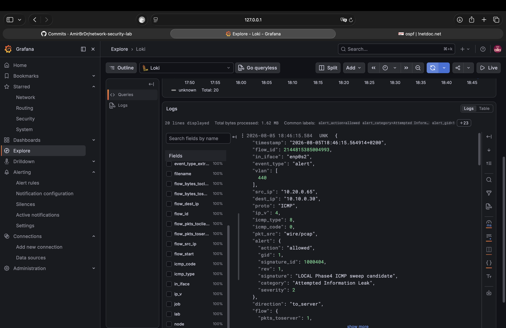

# Phase 4 Security Proof Report

Status: complete

Evidence window: August 2, 2026 through August 5, 2026

Phase 4 adds a Suricata IDS sensor to the Monitoring VM, mirrors selected
router VLANs to it through Open vSwitch, forwards Suricata EVE JSON to Loki,
exposes Suricata health and alert-count metrics to Prometheus, builds a
Grafana `Security` dashboard, and runs four controlled attack simulations
entirely inside lab-owned containers.

## Executive Summary

The captured evidence proves that the IDS pipeline observes, detects, stores,
and displays controlled lab attacks end to end:

- The Monitoring VM has a dedicated capture NIC (`enp0s2`, `tap67`) separate
  from its management NIC (`enp0s1`, `tap65`).
- An OVS mirror named `ids-phase4` on `dsw-host` copies VLANs `10`, `20`,
  `30`, `440`, `441`, and `442` from `tap62`, `tap63`, and `tap64` to `tap67`.
- Suricata 8.0.6 runs in AF_PACKET IDS mode on `enp0s2`, loads 52,163
  signatures (community rules plus four local Phase 4 rules), and writes EVE
  JSON to `/var/log/suricata/eve.json`.
- Grafana Alloy forwards `eve.json` to Loki as job `suricata-eve` alongside
  the existing `systemd-journal` job from Phase 3.
- A textfile-collector script and systemd timer expose
  `suricata_service_active`, `suricata_eve_alert_events_total`,
  `suricata_eve_last_alert_unixtime`, and `suricata_eve_last_success_unixtime`
  to Node Exporter on port `9100`.
- Three Prometheus alert rules (`SuricataServiceDown`, `SuricataTextfileStale`,
  `SuricataAlertObserved`) were added to the existing
  `network-security-lab` rule group, bringing it to 11 total rules.
- A Grafana `Security` dashboard shows IDS health, alert counters, top source
  IPs, raw EVE logs, and dedicated per-scenario incident panels.
- All four planned scenarios were run from the `R2` attacker container
  (`10.20.0.65`) against the `R1` victim container (`10.10.0.169`), and each
  fired its matching local Phase 4 rule: Nmap SYN scan, SSH connection burst,
  suspicious HTTP user agent, and ICMP sweep.
- All test traffic stayed inside documented lab prefixes
  (`10.10.0.0/24`, `10.20.0.0/24`, `10.30.0.0/24`, and the `10.44.0.0/29`
  transit ranges). No command targeted a system outside the lab.

## Evidence Index

| Area | Result | Primary evidence |
| --- | --- | --- |
| Capture path | Dedicated mirror NIC receives inter-container traffic not addressed to the sensor | [tcpdump on `enp0s2`](#ovs-mirror-and-capture-interface) |
| OVS mirror | `ids-phase4` mirrors VLANs `10,20,30,440,441,442` from the three router trunks to `tap67` | [mirror listing](#ovs-mirror-and-capture-interface) |
| Suricata | Runs in IDS/AF_PACKET mode, config test passes, four local rules loaded | [config test](#suricata-service-and-rule-loading) |
| Loki | `suricata-eve` job and `alert`/`flow`/`dns`/`tls`/`stats` event types visible | [Loki labels](#suricata-logs-in-loki) |
| Prometheus metrics | `suricata_service_active`, alert counters exposed and queryable | [node exporter output](#suricata-metrics) |
| Prometheus rules | 11 rules loaded, three Suricata rules present | [rules API](#prometheus-alert-rules) |
| Grafana dashboard | `Security` dashboard shows IDS health and per-scenario panels | [dashboard baseline](../../screenshots/phase4/phase4-security-dashboard-baseline.png) |
| Incident 1 - Nmap scan | Local rule `1000401` and community Nmap rules fired | [Grafana](../../screenshots/phase4/phase4-suricata-nmap-alert.png), [Loki](../../screenshots/phase4/phase4-loki-nmap-alert.png) |
| Incident 2 - SSH burst | Local rule `1000402` fired seven times for one 12-attempt burst | [Grafana](../../screenshots/phase4/phase4-suricata-ssh-burst-alert.png), [Loki](../../screenshots/phase4/phase4-loki-ssh-events.png) |
| Incident 3 - HTTP marker | Local rule `1000403` fired on the `phase4-suspicious-curl` user agent | [Grafana](../../screenshots/phase4/phase4-suricata-http-marker-alert.png), [Loki](../../screenshots/phase4/phase4-loki-http-event.png) |
| Incident 4 - ICMP sweep | Local rule `1000404` fired for each host past the 10-ping threshold | [Grafana](../../screenshots/phase4/phase4-suricata-icmp-sweep-alert.png), [Loki](../../screenshots/phase4/phase4-loki-icmp-sweep-alert.png) |

## Configuration Snapshots

| Component | Repository snapshot |
| --- | --- |
| Suricata lab configuration (HOME_NET, EVE, af-packet, rule-files) | [security/suricata/monitoring-suricata.yaml.snippet](../../security/suricata/monitoring-suricata.yaml.snippet) |
| Suricata local Phase 4 rules | [security/suricata/local-phase4.rules](../../security/suricata/local-phase4.rules) |
| Suricata textfile collector script | [security/suricata/monitoring-suricata_textfile.sh](../../security/suricata/monitoring-suricata_textfile.sh) |
| Suricata textfile systemd unit and timer | [security/suricata/monitoring-suricata-textfile.service](../../security/suricata/monitoring-suricata-textfile.service), [security/suricata/monitoring-suricata-textfile.timer](../../security/suricata/monitoring-suricata-textfile.timer) |
| Alloy EVE JSON forwarding, monitoring VM | [configs/monitoring-config.alloy](../../configs/monitoring-config.alloy) |
| Prometheus alert rules (Phase 3 + Phase 4 combined group) | [configs/prometheus-rules.yml](../../configs/prometheus-rules.yml) |

`/etc/default/suricata` is not used on this Monitoring VM. The Ubuntu
`suricata` package unit runs `suricata -D --af-packet -c
/etc/suricata/suricata.yaml`, so the capture interface is read directly from
the `af-packet` block in `suricata.yaml` rather than from `/etc/default/suricata`.
That file path is specific to the OISF PPA package, which this lab did not
need.

## Security Addressing And Roles

| Node | Role | Interface | Address |
| --- | --- | --- | --- |
| `monitoring` | IDS sensor, management | `enp0s1` (`tap65`) | `10.99.0.65/24`, `fd14:ca46:3864:99::65/64` |
| `monitoring` | IDS sensor, mirror receiver | `enp0s2` (`tap67`) | No IP, promiscuous, link-local only |
| `R2` container `c0` | Attacker | VLAN `20` | `10.20.0.65` |
| `R1` container `c0` | Victim, SSH + HTTP | VLAN `10` | `10.10.0.169` |
| `R3` container `c0` | Optional extra target | VLAN `30` | `10.30.0.30` |

All addresses are inside the documented lab prefixes
(`10.10.0.0/24`, `10.20.0.0/24`, `10.30.0.0/24`). No public or external
address was used as a source or destination in any scenario.

## Result Summary

| Check | Result |
| --- | --- |
| Management reachability | IPv4 pings from `monitoring` to `R1`, `R2`, `R3`, and `management` returned `0%` packet loss. Loki and Prometheus both returned ready. |
| Pre-mirror visibility | `tcpdump` on `enp0s1` before mirroring showed only management-plane and broadcast traffic, confirming the access port does not see routed container traffic. |
| OVS mirror | One mirror, `ids-phase4`, active on `dsw-host` with `tap67` as output and `tap62`/`tap63`/`tap64` selected for VLANs `10,20,30,440,441,442`. |
| Post-mirror visibility | `tcpdump` on `enp0s2` showed inter-container ICMP, OSPFv2, and OSPFv3 traffic not addressed to the sensor, confirming the mirror works. |
| Suricata config test | `suricata -T` completed successfully: 52,158 community rules plus 4 local Phase 4 rules loaded, 0 failed. |
| Suricata service | `suricata.service` active since 2026-08-02 18:06:59 CEST (running continuously through the evidence window). |
| Local rule loading | `suricata --dump-config` confirms `local-phase4.rules` in the active rule path; all four `LOCAL Phase4` signatures are present. |
| Loki forwarding | Job `suricata-eve` and event types `alert`, `dns`, `flow`, `stats`, `tls` are queryable from the Management VM. |
| Alloy service | Active since 2026-08-02 19:42:42 CEST, no permission or connection errors. |
| Prometheus metrics | `suricata_service_active{node="monitoring"} 1`; alert counter increased from `357` at initial validation to `4554` after all four scenarios. |
| Prometheus rules | `promtool check rules` succeeded with 11 rules found; `SuricataServiceDown`, `SuricataTextfileStale`, and `SuricataAlertObserved` all present in the API. |
| Node Exporter service | `prometheus-node-exporter.service` active since 2026-08-02 19:21:28 CEST. |
| Textfile timer | `suricata-textfile.timer` active since 2026-08-02 19:49:35 CEST, refreshing every 15 seconds; collector age observed at 7-17 seconds. |
| Incident 1 - Nmap scan | `LOCAL Phase4 TCP SYN scan candidate` (sid `1000401`) and multiple ET SCAN/community Nmap signatures fired against `10.10.0.169`. |
| Incident 2 - SSH burst | `LOCAL Phase4 SSH connection burst` (sid `1000402`) fired 7 times for a 12-attempt burst; victim `auth.log` confirms 12 rejected logins. |
| Incident 3 - HTTP marker | `LOCAL Phase4 suspicious HTTP user agent` (sid `1000403`) fired once on the `phase4-suspicious-curl` marker against a 404 request. |
| Incident 4 - ICMP sweep | `LOCAL Phase4 ICMP sweep candidate` (sid `1000404`) fired once the 10-ping/60s threshold was crossed, repeating per swept host. |

## Screenshot Evidence

### Security Dashboard

**Security dashboard baseline: IDS health, alerts, top source IPs, raw EVE logs**



### Incident 1 - Nmap Reconnaissance Scan

**Suricata alert in Grafana (Nmap Incident panel)**



**Loki alert query for the Nmap scan window**



### Incident 2 - SSH Connection Burst

**Suricata SSH burst alert in Grafana (SSH burst incident panel)**



**Loki SSH burst event detail**



### Incident 3 - Suspicious HTTP Marker

**Suricata HTTP marker alert in Grafana (Local Rules Alerts panel)**



**Loki HTTP marker event detail**



### Incident 4 - ICMP Sweep

**Suricata ICMP sweep alert in Grafana (Local Rules Alerts panel)**



**Loki ICMP sweep event detail**



## Command Evidence

### Management Reachability

```console
etu@monitoring:~$ for host in 10.99.0.1 10.99.0.2 10.99.0.3 10.99.0.66; do
    ping -c 2 "$host"
done
PING 10.99.0.1 (10.99.0.1) 56(84) bytes of data.
64 bytes from 10.99.0.1: icmp_seq=1 ttl=64 time=0.839 ms
--- 10.99.0.1 ping statistics ---
2 packets transmitted, 2 received, 0% packet loss
--- 10.99.0.2 ping statistics ---
2 packets transmitted, 2 received, 0% packet loss
--- 10.99.0.3 ping statistics ---
2 packets transmitted, 2 received, 0% packet loss
--- 10.99.0.66 ping statistics ---
2 packets transmitted, 2 received, 0% packet loss

etu@monitoring:~$ curl -s http://10.99.0.66:3100/ready
ready
etu@monitoring:~$ curl -s http://10.99.0.66:9090/-/ready
Prometheus Server is Ready.
```

### OVS Mirror And Capture Interface

```console
amirmahdighasemi@bob:~$ sudo ovs-vsctl list Bridge dsw-host
mirrors : [de7336df-ff02-4604-b14a-bb365ceabe1f]
name    : dsw-host

amirmahdighasemi@bob:~$ sudo ovs-vsctl list Mirror ids-phase4
name            : ids-phase4
output_port     : 5a792604-dd4d-460a-9800-4e56d5de9d01
select_dst_port : [tap62, tap63, tap64]
select_src_port : [tap62, tap63, tap64]
select_vlan     : [10, 20, 30, 440, 441, 442]
statistics      : {tx_bytes=5004, tx_packets=54}
```

```console
etu@monitoring:~$ ip -br link
enp0s1  UP  10.99.0.65/24 fd14:ca46:3864:99::65/64
enp0s2  UP  (mirror receiver, promiscuous, no IP)

etu@monitoring:~$ sudo timeout 30 tcpdump -eni enp0s2 -c 50
17:27:31 vlan 440, 10.10.0.169 > 10.20.0.55: ICMP echo request
17:27:32 vlan 441, OSPFv3 Hello
17:27:37 vlan 440, 10.44.0.2 > 224.0.0.5: OSPFv2 Hello
50 packets captured, 0 packets dropped by kernel
```

The mirror correctly delivers inter-container and inter-router traffic that
is not addressed to `10.99.0.65`, confirming the capture path is usable
before running any scenario.

### Suricata Service And Rule Loading

```console
etu@monitoring:~$ suricata -V
This is Suricata version 8.0.6 RELEASE

etu@monitoring:~$ sudo suricata -T -c /etc/suricata/suricata.yaml -v
Notice: suricata: This is Suricata version 8.0.6 RELEASE running in SYSTEM mode
Info: suricata: Setting engine mode to IDS mode by default
Info: detect: 1 rule files processed. 52158 rules successfully loaded, 0 rules failed, 0 rules skipped
Info: detect: 52163 signatures processed. 1292 are IP-only rules, 4510 are inspecting packet payload, 46126 inspect application layer, 110 are decoder event only
Notice: suricata: Configuration provided was successfully loaded. Exiting.

etu@monitoring:~$ sudo suricata --dump-config | grep -E "default-rule-path|local-phase4"
default-rule-path = /var/lib/suricata/rules
rule-files.1 = local-phase4.rules

etu@monitoring:~$ sudo grep -R "LOCAL Phase4" /var/lib/suricata/rules
/var/lib/suricata/rules/local-phase4.rules:alert tcp $EXTERNAL_NET any -> $HOME_NET any (msg:"LOCAL Phase4 TCP SYN scan candidate"; ...; sid:1000401; rev:1;)
/var/lib/suricata/rules/local-phase4.rules:alert tcp $EXTERNAL_NET any -> $HOME_NET 22 (msg:"LOCAL Phase4 SSH connection burst"; ...; sid:1000402; rev:1;)
/var/lib/suricata/rules/local-phase4.rules:alert http $EXTERNAL_NET any -> $HOME_NET any (msg:"LOCAL Phase4 suspicious HTTP user agent"; ...; sid:1000403; rev:1;)
/var/lib/suricata/rules/local-phase4.rules:alert icmp $EXTERNAL_NET any -> $HOME_NET any (msg:"LOCAL Phase4 ICMP sweep candidate"; ...; sid:1000404; rev:1;)

etu@monitoring:~$ systemctl status suricata --no-pager
● suricata.service - Suricata IDS/IDP daemon
     Loaded: loaded (/usr/lib/systemd/system/suricata.service; enabled; preset: enabled)
     Active: active (running) since Sun 2026-08-02 18:06:59 CEST; 3 days ago

etu@monitoring:~$ systemctl cat suricata
ExecStart=/usr/bin/suricata -D --af-packet -c /etc/suricata/suricata.yaml --pidfile /var/run/suricata/suricata.pid
```

The Ubuntu package unit passes `--af-packet` directly and reads the
interface from the `af-packet` block in `suricata.yaml`, so no
`/etc/default/suricata` override was required.

### Suricata Logs In Loki

```console
etu@management:~$ curl -G -s "http://10.99.0.66:3100/loki/api/v1/label/job/values" | jq
{
  "status": "success",
  "data": ["suricata-eve", "systemd-journal"]
}

etu@management:~$ curl -G -s "http://10.99.0.66:3100/loki/api/v1/label/event_type/values" | jq
{
  "status": "success",
  "data": ["alert", "dns", "flow", "stats", "tls"]
}
```

`http` and `ssh` event types were confirmed through direct EVE JSON records
during the scenarios (see incident evidence below) even though they did not
appear in the label-values snapshot taken before traffic was generated.

### Suricata Metrics

```console
etu@management:~$ curl -s "http://10.99.0.65:9100/metrics" | grep '^suricata_'
suricata_eve_alert_events_total{node="monitoring"} 357
suricata_eve_last_alert_unixtime{node="monitoring"} 1.785692072e+09
suricata_eve_last_success_unixtime{node="monitoring"} 1.785693006e+09
suricata_service_active{node="monitoring"} 1
```

After the four scenarios were run, the alert counter had grown to `4554` and
the service remained active with a fresh collector age:

```console
etu@monitoring:~$ systemctl status suricata alloy prometheus-node-exporter suricata-textfile.timer --no-pager
● suricata.service                    active (running) since 2026-08-02 18:06:59 CEST
● alloy.service                       active (running) since 2026-08-02 19:42:42 CEST
● prometheus-node-exporter.service    active (running) since 2026-08-02 19:21:28 CEST
● suricata-textfile.timer             active (running) since 2026-08-02 19:49:35 CEST
  Triggers: suricata-textfile.service

etu@management:~$ curl -s http://127.0.0.1:9090/api/v1/query --data-urlencode 'query=suricata_service_active' | jq -c .
{"status":"success","data":{"resultType":"vector","result":[{"metric":{"__name__":"suricata_service_active","node":"monitoring","role":"ids"},"value":[1785949327.615,"1"]}]}}

etu@management:~$ curl -s http://127.0.0.1:9090/api/v1/query --data-urlencode 'query=suricata_eve_alert_events_total' | jq -c .
{"status":"success","data":{"resultType":"vector","result":[{"metric":{"__name__":"suricata_eve_alert_events_total","node":"monitoring","role":"ids"},"value":[1785949328.574,"4554"]}]}}
```

### Prometheus Alert Rules

```console
etu@management:~$ promtool check rules /etc/prometheus/rules/network-security-lab.yml
Checking /etc/prometheus/rules/network-security-lab.yml
  SUCCESS: 11 rules found

etu@management:~$ curl -s http://127.0.0.1:9090/api/v1/rules | jq '.data.groups[].rules[] | select(.name|test("Suricata")) | {name,health,type}'
{"name": "SuricataServiceDown",   "health": "unknown", "type": "alerting"}
{"name": "SuricataTextfileStale", "health": "unknown", "type": "alerting"}
{"name": "SuricataAlertObserved", "health": "unknown", "type": "alerting"}
```

### Attacker And Victim Endpoints

```console
etu@R1:~$ incus exec c0 -- bash -lc 'ss -ltnp'
LISTEN 0 128    0.0.0.0:22   0.0.0.0:*  users:(("sshd",pid=1413,fd=6))
LISTEN 0 5      0.0.0.0:80   0.0.0.0:*  users:(("python3",pid=2026,fd=3))

etu@R2:~$ incus exec c0 -- ping -c 3 10.10.0.169
3 packets transmitted, 3 received, 0% packet loss
etu@R2:~$ incus exec c0 -- curl -s http://10.10.0.169/
phase4 victim service
```

## Incident Reports

### Incident 1: Nmap Reconnaissance Scan

Status: validated

Time window:

- Start: 2026-08-05T17:49:44+02:00
- End: 2026-08-05T17:49:50+02:00

Scope:

- Attacker: `R2` container `c0`, `10.20.0.65`
- Victim: `R1` container `c0`, `10.10.0.169`
- IDS: `monitoring`, `10.99.0.65`

Scenario:

From the attacker container, `nmap -Pn -sS -sV -p 1-1000 --reason 10.10.0.169`
ran a SYN scan with service/version detection against the victim's first
1000 TCP ports. Both endpoints and the IDS are lab-owned, so the scan is
safe inside the documented boundary.

```console
etu@R2:~$ incus exec c0 -- nmap -Pn -sS -sV -p 1-1000 --reason 10.10.0.169
Nmap scan report for 10.10.0.169
PORT   STATE SERVICE REASON         VERSION
22/tcp open  ssh     syn-ack ttl 62 OpenSSH 10.0p2 Debian 7+deb13u4 (protocol 2.0)
80/tcp open  http    syn-ack ttl 62 SimpleHTTPServer 0.6 (Python 3.13.5)
Nmap done: 1 IP address (1 host up) scanned in 6.31 seconds
```

Detection:

- Suricata signature: `LOCAL Phase4 TCP SYN scan candidate` (sid `1000401`), plus
  community signatures `ET SCAN Possible Nmap User-Agent Observed` and
  `ET SCAN Nmap Scripting Engine User-Agent Detected`.
- Suricata event type: `alert`
- Loki query: `{job="suricata-eve", event_type="alert"} | json | alert_signature =~ ".*SYN scan.*|.*Nmap.*"`
- Prometheus metric: `suricata_eve_alert_events_total` increased during the scan window.

Evidence:

- Screenshot: [phase4-suricata-nmap-alert.png](../../screenshots/phase4/phase4-suricata-nmap-alert.png), [phase4-loki-nmap-alert.png](../../screenshots/phase4/phase4-loki-nmap-alert.png)
- Command output: see [Attacker And Victim Endpoints](#attacker-and-victim-endpoints) command block above
- Relevant log excerpt:

```json
{"timestamp":"2026-08-05T17:49:50.463225+0200","src_ip":"10.20.0.65","dest_ip":"10.10.0.169","signature":"LOCAL Phase4 TCP SYN scan candidate","severity":2}
```

Impact:

On a production network, this pattern indicates a reconnaissance sweep
enumerating open ports and service versions ahead of a targeted exploit
attempt.

Response:

An operator should identify the source, check whether it is an authorized
scanner, and if not, correlate the source with other alerts before deciding
on containment.

Limitations:

The community Nmap-detection rules alert on the Nmap-generated HTTP
User-Agent string during service/version probing, not purely on SYN packet
timing. The local `1000401` rule is the deterministic, threshold-based
signal for the SYN scan itself (25 SYNs from one source within 60 seconds).

Conclusion:

Suricata detected the controlled Nmap scan through both a local deterministic
rule and community signatures, the alert reached Loki with correct source and
destination fields, and Grafana displayed it inside the test window.

### Incident 2: SSH Connection Burst

Status: validated

Time window:

- Start: 2026-08-05T18:27:23+02:00
- End: 2026-08-05T18:27:25+02:00

Scope:

- Attacker: `R2` container `c0`, `10.20.0.65`
- Victim: `R1` container `c0`, `10.10.0.169`
- IDS: `monitoring`, `10.99.0.65`

Scenario:

From the attacker container, a loop attempted 12 SSH connections to the
victim using invalid usernames (`invalid1` through `invalid12`) with
`BatchMode=yes`, so no credentials were guessed and no authentication was
attempted beyond the initial handshake. This is safe inside the lab because
no valid account is targeted and both endpoints are lab-owned.

```console
etu@R2:~$ for i in $(seq 1 12); do
  ssh -o BatchMode=yes -o StrictHostKeyChecking=no -o UserKnownHostsFile=/dev/null \
      -o ConnectTimeout=2 "invalid${i}@10.10.0.169" true </dev/null 2>/dev/null || true
done
```

Detection:

- Suricata signature: `LOCAL Phase4 SSH connection burst` (sid `1000402`)
- Suricata event type: `alert`
- Loki query: `{job="suricata-eve", event_type="alert"} | json | alert_signature =~ ".*SSH connection burst.*"`
- Prometheus metric: `suricata_eve_alert_events_total` increased during the burst window.

Evidence:

- Screenshot: [phase4-suricata-ssh-burst-alert.png](../../screenshots/phase4/phase4-suricata-ssh-burst-alert.png), [phase4-loki-ssh-events.png](../../screenshots/phase4/phase4-loki-ssh-events.png)
- Command output: SSH loop above
- Relevant log excerpt:

```json
{"timestamp":"2026-08-05T18:27:24.013951+0200","src_ip":"10.20.0.65","dest_ip":"10.10.0.169","signature":"LOCAL Phase4 SSH connection burst"}
```

- Victim SSH logs:

```console
etu@R1:~$ incus exec c0 -- journalctl -u ssh -n 80 --no-pager
Aug 05 16:27:23 c0 sshd-session[2699]: Invalid user invalid1 from 10.20.0.65 port 36288
Aug 05 16:27:23 c0 sshd-session[2699]: Connection closed by invalid user invalid1 10.20.0.65 port 36288 [preauth]
... (12 invalid-user attempts total, ports 36288-36352)
```

Impact:

A burst of SSH connection attempts from one source in a short window is a
classic precursor to a credential brute-force or user-enumeration attack.

Response:

An operator should confirm whether the source is an authorized
administrator, check for successful logins from the same source, and
consider a temporary block if the burst continues or targets multiple hosts.

Limitations:

The scenario used `BatchMode=yes`, so it proves SSH connection-attempt
detection but does not exercise password-guessing or credential-stuffing
detection paths.

Conclusion:

Suricata's local SSH-burst rule fired seven times for the 12-attempt burst,
matching the detection-filter threshold (5 SYNs to port 22 within 60
seconds), and the victim's own `sshd` logs independently confirm all 12
attempts, cross-validating the IDS alert.

### Incident 3: Suspicious HTTP Marker

Status: validated

Time window:

- Start: 2026-08-05T18:41:43+02:00
- End: 2026-08-05T18:41:44+02:00

Scope:

- Attacker: `R2` container `c0`, `10.20.0.65`
- Victim: `R1` container `c0`, `10.10.0.169`
- IDS: `monitoring`, `10.99.0.65`

Scenario:

From the attacker container, a single `curl` request set a deliberately
harmless but specific User-Agent string, `phase4-suspicious-curl`, against a
nonexistent path on the victim's HTTP service. This proves Suricata parses
HTTP and can alert on application-layer content, without using any real
malicious payload.

```console
etu@R2:~$ incus exec c0 -- curl -A "phase4-suspicious-curl" -s "http://10.10.0.169/phase4-test"
<h1>Error response</h1><p>Error code: 404</p>
```

Detection:

- Suricata signature: `LOCAL Phase4 suspicious HTTP user agent` (sid `1000403`)
- Suricata event type: `alert` (matched on `http.user_agent`)
- Loki query: `{job="suricata-eve", event_type="alert"} | json | alert_signature =~ ".*suspicious HTTP user agent.*"`
- Prometheus metric: `suricata_eve_alert_events_total` incremented by one.

Evidence:

- Screenshot: [phase4-suricata-http-marker-alert.png](../../screenshots/phase4/phase4-suricata-http-marker-alert.png), [phase4-loki-http-event.png](../../screenshots/phase4/phase4-loki-http-event.png)
- Command output: `curl` command above
- Relevant log excerpt:

```json
{"timestamp":"2026-08-05T18:41:43.689767+0200","src_ip":"10.20.0.65","dest_ip":"10.10.0.169","signature":"LOCAL Phase4 suspicious HTTP user agent"}
```

Impact:

Demonstrates that the IDS can inspect and alert on HTTP request metadata,
which is the same mechanism used to detect malicious User-Agent strings,
known scanner tools, or malware C2 beacons in a real deployment.

Response:

An operator should inspect the full HTTP transaction (method, path, headers)
and correlate the source with other alerts before deciding whether it is
benign tooling or an actual threat.

Limitations:

The marker string is artificial and would never appear on a real network.
This scenario proves HTTP content inspection works, not that Suricata
detects real-world malicious User-Agents without an appropriate rule.

Conclusion:

The single request matched the local content rule exactly once, confirming
Suricata's HTTP parser and `http.user_agent` keyword work correctly end to
end through Loki and Grafana.

### Incident 4: ICMP Sweep

Status: validated

Time window:

- Start: 2026-08-05T18:45:47+02:00
- End: 2026-08-05T18:46:16+02:00

Scope:

- Attacker: `R2` container `c0`, `10.20.0.65`
- Victim range: `R1` hosting network, `10.10.0.1` - `10.10.0.30`
- IDS: `monitoring`, `10.99.0.65`

Scenario:

From the attacker container, a loop sent one ICMP echo request to each of
30 addresses in the victim subnet (`10.10.0.1` through `10.10.0.30`),
simulating a simple host-discovery sweep. All targets are inside the
documented `10.10.0.0/24` hosting prefix.

```console
etu@R2:~$ for ip in $(seq 1 30); do
  ping -c 1 -W 1 "10.10.0.$ip" >/dev/null 2>&1 || true
done
```

Detection:

- Suricata signature: `LOCAL Phase4 ICMP sweep candidate` (sid `1000404`)
- Suricata event type: `alert`
- Loki query: `{job="suricata-eve", event_type="alert"} | json | alert_signature =~ ".*ICMP sweep.*"`
- Prometheus metric: `suricata_eve_alert_events_total` increased for each swept host once the threshold was crossed.

Evidence:

- Screenshot: [phase4-suricata-icmp-sweep-alert.png](../../screenshots/phase4/phase4-suricata-icmp-sweep-alert.png), [phase4-loki-icmp-sweep-alert.png](../../screenshots/phase4/phase4-loki-icmp-sweep-alert.png)
- Command output: `ping` loop above
- Relevant log excerpt:

```json
{"timestamp":"2026-08-05T18:46:06.517699+0200","src_ip":"10.20.0.65","dest_ip":"10.10.0.21","signature":"LOCAL Phase4 ICMP sweep candidate"}
{"timestamp":"2026-08-05T18:46:15.564914+0200","src_ip":"10.20.0.65","dest_ip":"10.10.0.30","signature":"LOCAL Phase4 ICMP sweep candidate"}
```

Impact:

An ICMP sweep across a subnet is a low-noise host-discovery technique often
used before a more targeted scan, and detecting it gives an early warning
signal.

Response:

An operator should note the swept range, watch for a follow-up port scan
from the same source, and confirm whether the source is an authorized
monitoring or inventory tool.

Limitations:

The detection filter requires 10 echo requests from one source within 60
seconds before it fires, so it only starts alerting partway through the
30-host sweep (first alert at host `.21`), not from the first ping. A
slower or smaller sweep would not cross the threshold.

Conclusion:

Suricata's local ICMP-sweep rule fired once the detection threshold was
reached and continued alerting per swept host for the remainder of the run,
confirming detection_filter-based thresholds behave as configured.

## Completion Checklist

- [x] Monitoring VM has a dedicated mirror capture interface (`enp0s2`/`tap67`) separate from management (`enp0s1`/`tap65`).
- [x] OVS mirror `ids-phase4` configured on `dsw-host` for VLANs `10,20,30,440,441,442`.
- [x] Pre-mirror and post-mirror visibility both confirmed with `tcpdump`.
- [x] Suricata installed, configuration validated, and running in AF_PACKET IDS mode.
- [x] Four local Phase 4 detection rules created and loaded.
- [x] EVE JSON enabled with alert, flow, HTTP, DNS, TLS, and SSH event types.
- [x] Grafana Alloy forwards `eve.json` to Loki as job `suricata-eve`.
- [x] Suricata textfile collector and systemd timer expose health and alert-count metrics.
- [x] Three Suricata Prometheus alert rules added to the `network-security-lab` group.
- [x] Grafana `Security` dashboard built with IDS health, alert, and per-scenario panels.
- [x] Attacker and victim containers prepared and connectivity validated.
- [x] Scenario 1 (Nmap scan) run and detected.
- [x] Scenario 2 (SSH connection burst) run and detected.
- [x] Scenario 3 (suspicious HTTP marker) run and detected.
- [x] Scenario 4 (ICMP sweep) run and detected.
- [x] Screenshots captured and saved under `screenshots/phase4/`.
- [x] Configuration files backed up into the repository.
- [x] Four incident reports written (two more than the required minimum of two).
- [x] All simulations stayed inside documented lab prefixes.

## Notes

- Phase 4 documents four incidents instead of the minimum two, since all four
  planned scenarios were run successfully in the same session.
- `/etc/default/suricata` is not used by the Ubuntu `suricata` package on this
  VM; the systemd unit passes `--af-packet` directly, so the capture
  interface comes entirely from the `af-packet` block in `suricata.yaml`.
- Community ET rules (for example `ET SCAN Possible Nmap User-Agent
  Observed` and `ET INFO Python SimpleHTTP ServerBanner`) also fired
  alongside the local Phase 4 rules during testing. They were left enabled;
  no noise-reduction tuning was necessary to keep the four local rules
  readable in Grafana and Loki.
- This report does not include separate screenshots for
  `systemctl status suricata` health, the raw Loki job-label listing, or the
  Prometheus alert-counter graph, since that data is captured directly as
  command output above and inside the dashboard baseline screenshot instead.
- PCAP files from the scenarios were not committed to the repository, in
  line with the tutorial's guidance not to commit large captures without
  explicit sanitization.
- The IDS observed only the mirrored VLANs; management VLAN `99` traffic was
  intentionally not mirrored, so Suricata does not see SSH sessions to the
  routers or VMs themselves.
